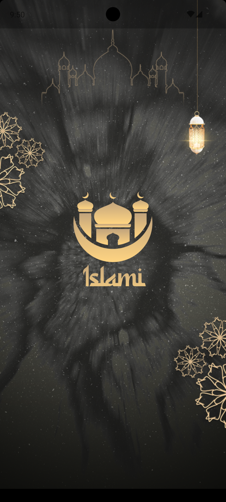
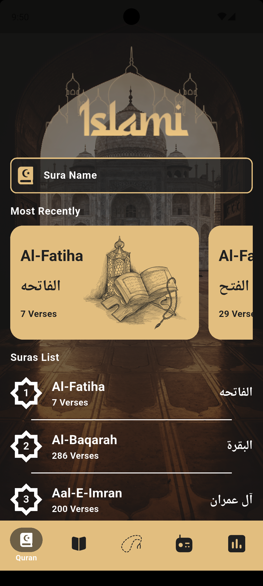
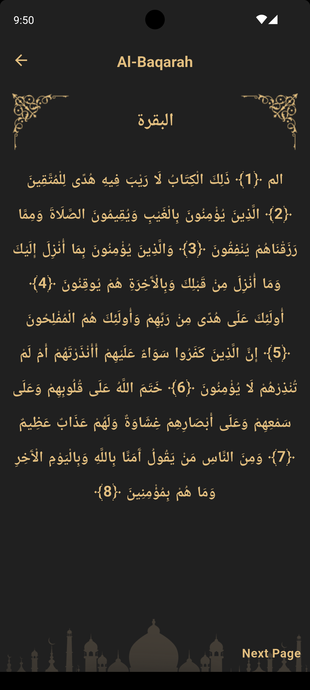
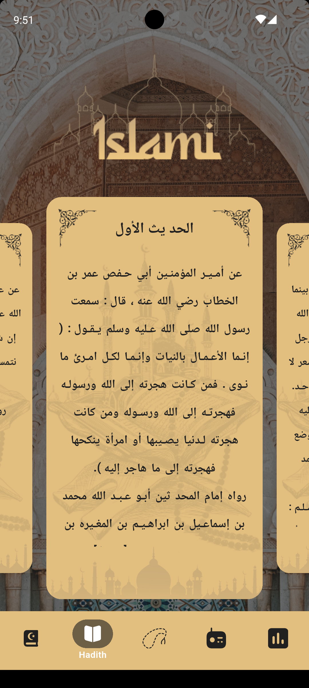
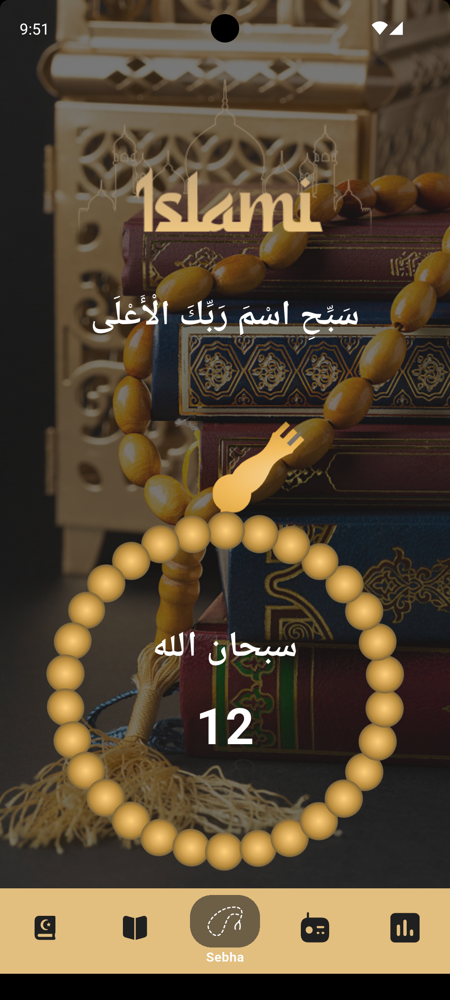
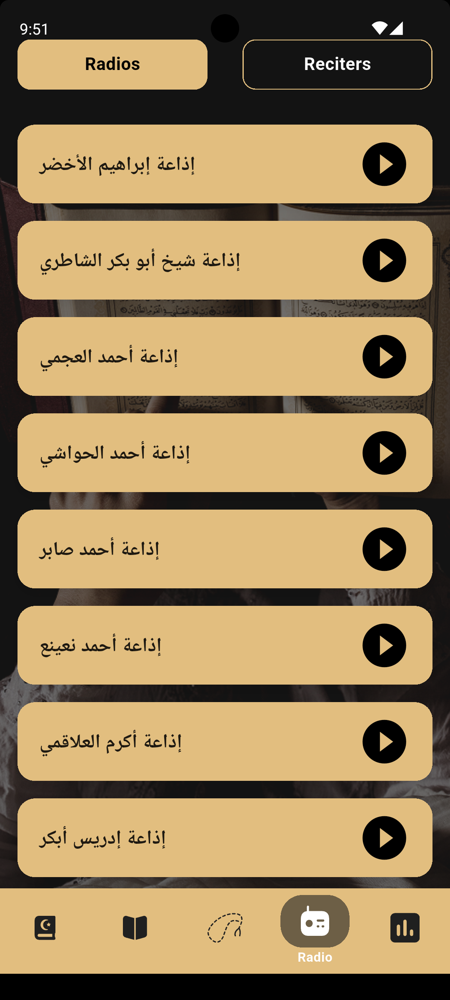
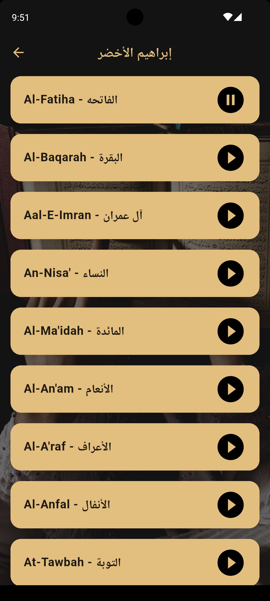
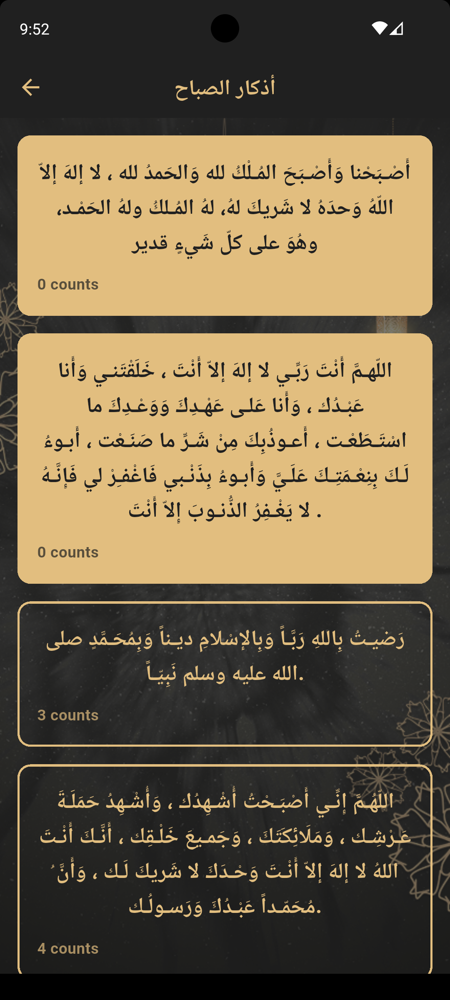

  <h1>🕌 Islami App</h1>
  
<strong>Islami App is a comprehensive, production-ready Flutter application designed to be a daily companion for Muslims. Built with a focus on high performance, clean code, and a seamless user experience.</strong>

 

## 📱 Screenshots

<table align="center">
  <tr>
    <td></td>
    <td></td>
    <td></td>
    <td></td>
  </tr>
  <tr>
    <td></td>
    <td></td>
    <td></td>
    <td></td>
  </tr>
</table>

## ✨ Core Features

* **📖 Holy Quran**: Digital Quran with a high-speed search engine for verses and Surahs.
* **🔄 Smart Resume**: Automatically saves your progress to pick up exactly where you left off.
* **🎧 Multimedia**: Live Islamic Radio streams and a diverse library of world-class reciters.
* **🕒 Precise Prayer Times**: Accurate timings based on location with a countdown for the next prayer.
* **📿 Digital Tasbih**: Interactive Electronic Sebha with session tracking.
* **📚 Hadith & Azkar**: Categorized Prophetic Hadiths and a comprehensive library of daily Supplications (Azkar) with interactive counters.

## 🚀 Technical Stack

* **Framework**: Flutter
* **Architecture**: MVVM (Model-View-ViewModel) for clear separation of concerns.
* **State Management**: Flutter Bloc (Cubit) for predictable and robust state handling.
* **Networking**: Integration with real-time REST APIs.
* **Local Storage**: Efficient tracking for "Most Recent" reading and Sebha progress.
